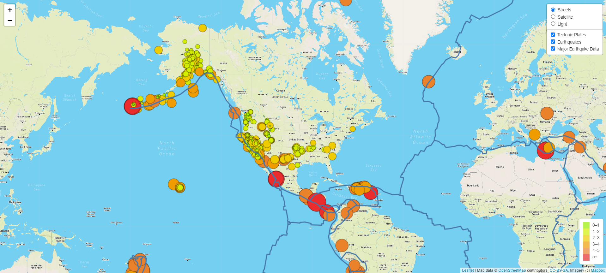
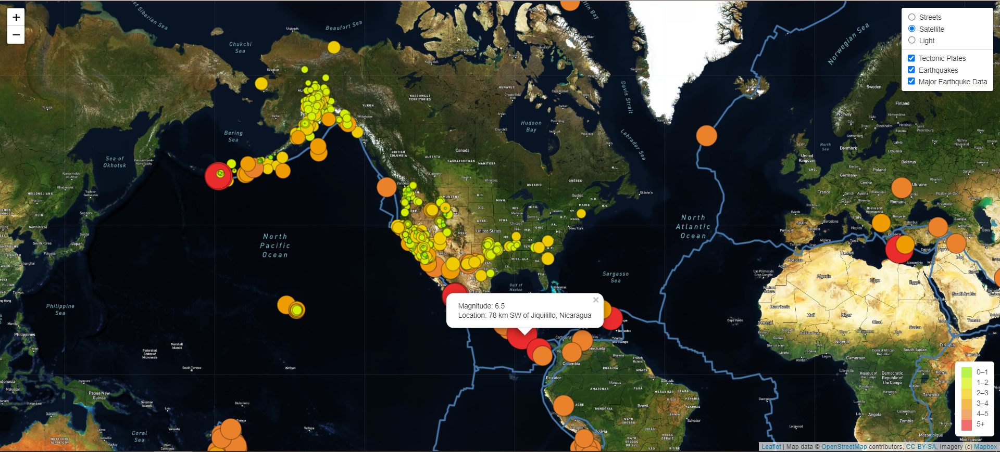
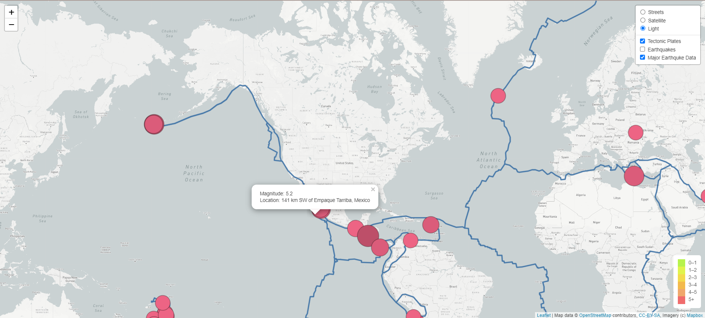

# Mapping_Earthquakes
### Project Overview
This project is using JavaScript and the D3.js library to retrieve the earthquakes data and tectonic plate data from the GeoJSON data. Next, use Leaflet library to plot the data on a Mapbox map through an API request. Finally, create interactive maps showing the earthquake data in relation to the tectonic plates’ location on the earth as well as the differences between the magnitudes of earthquakes all over the world for the last seven days.

### Resources

- Earthquake Data: [U.S. Geological Survey (USGS)](https://earthquake.usgs.gov/earthquakes/feed/v1.0/geojson.php)
- Tectonic Plates: [Tectonic Plates Data](https://github.com/fraxen/tectonicplates)

### Result

###### Streets map with all earthquake data

###### Satellite map with all earthquake data

###### Light map with major earthquake data

